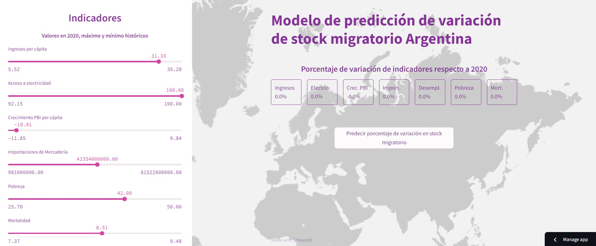

# MODELO DE PREDICCIÓN 
# VARIACIÓN DE STOCK MIGRATORIO EN ARGENTINA 🌎

## Repositorio para el deploy del modelo ML de migración 

[Repo_principal](https://github.com/DATASCIENTISTSHENRY/PF_DataScience_Migraciones)

link al modelo https://migracion.streamlit.app/

El propósito principal del modelo consiste en estimar el impacto de las variaciones en los indicadores, Ingresos per cápita, Acceso a electricidad, Crecimiento PBI per cápita, Importaciones de Mercadería, Personas desempleadas de educación avanzada, Pobreza y Mortalidad, en la cantidad de inmigrantes que recibe argentina.

Para la construcción de este modelo, se generó un conjunto de datos que abarca el período de 1995 a 2020, incluyendo información sobre el stock migratorio (valor a predecir) de todos los países reconocidos por las Naciones Unidas. Este conjunto de datos también contiene los valores correspondientes a los indicadores mencionados en las columnas. [Enlace a ETL](EDA_ETL/EDA_datasets_internacionales.ipynb)

Se seleccionaron las filas que contenían más del 70% de las características no nulas, y se realizaron imputaciones de valores faltantes mediante la técnica de KNN.

Se exploraron varios modelos de regresión, siendo XGBoostRegressor el que ofreció el rendimiento óptimo, ajustando los hiperparámetros con OPTUNA con cross validation.

En términos de evaluación del modelo, se logró un coeficiente de determinación (R2) de 0.97, aunque el Valor Absoluto Medio (MAE) fue de 339239. Al analizar las predicciones para Argentina, se observó que, en el conjunto de pruebas, las predicciones fueron sistemáticamente menores que los valores reales, pero copiaban la tendencia de los valores reales.

Mediante la librearia streamlit se creo una aplicacción que determina el porcentaje de variacion del stock migratorio en Argentina ante variaciones en los indicadores estudiados.

